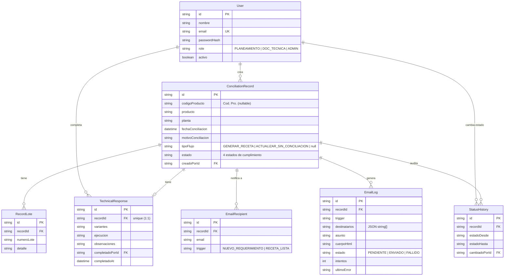
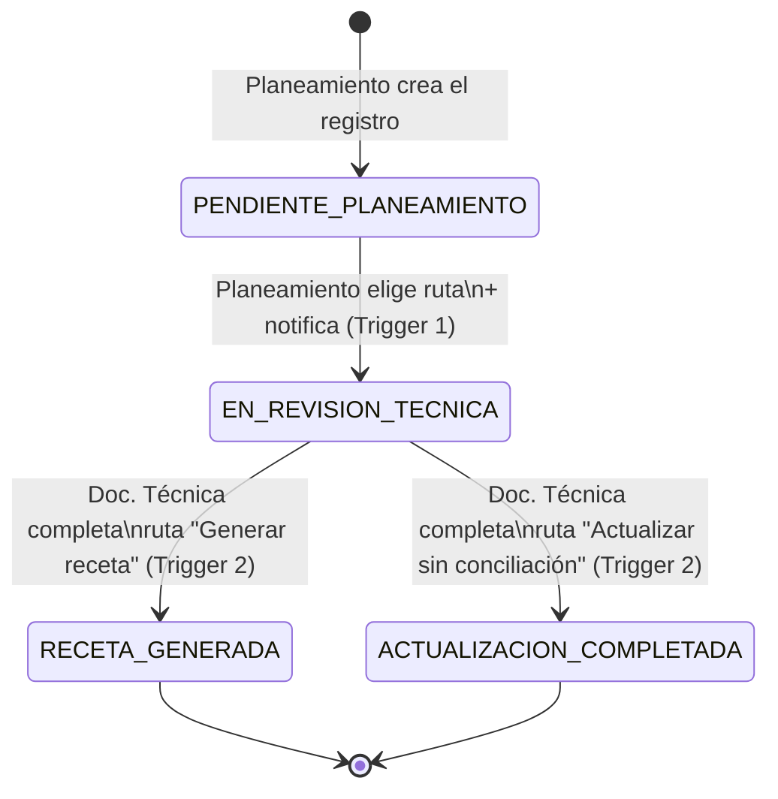
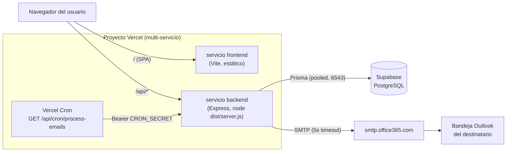

# Recetas de Conciliación — Diseño de Solución

Reemplazo del Excel "Cuadro de Conciliaciones" (histórico analizado: 1369 filas con
Cod. Pro., Producto, Planta, Fecha de Conciliación, Motivo de Conciliación y columnas
de respuesta libre por área — Almacén, Asuntos Regulatorios, Diseño/Logística,
Documentación Técnica — sin ningún control de estado real, solo una "X" al final).

Este documento cubre los 3 entregables solicitados:
1. Esquema de base de datos relacional.
2. Arquitectura del backend para el envío de correo asíncrono.
3. Controlador de API que procesa el cambio de estado y dispara el correo.

---

## 1. Esquema de base de datos relacional

Motor: **PostgreSQL** (desplegado sobre Supabase). Los campos de tipo cerrado
(`role`, `estado`, `tipoFlujo`, `trigger`, `estado` de correo) son `enum` nativos de
Postgres/Prisma — con integridad garantizada por la propia base de datos, más la
validación de forma (Zod) en el backend y las mismas listas de valores replicadas en
TypeScript en el frontend (`frontend/src/types.ts`).



Definición completa en [`backend/prisma/schema.prisma`](../backend/prisma/schema.prisma).

### Por qué estas entidades

- **`ConciliationRecord`** es la fila del Excel, normalizada: `Cod. Pro.`, `Producto`,
  `Planta`, `Fecha de Conciliación`, `Motivo de Conciliación` se mapean 1 a 1. Se le
  agrega `tipoFlujo` (la decisión de ruta) y `estado` (el estado de cumplimiento).
- **`RecordLote`** normaliza los lotes/materiales que en el Excel viven como texto
  libre dentro de una sola celda — así se pueden listar, contar y (a futuro) filtrar.
- **`TechnicalResponse`** es 1 a 1 con el registro y contiene exactamente los campos
  que pidió el rol Documentación Técnica: Variantes, Ejecución, Observaciones.
- **`EmailRecipient`** guarda qué correos se ingresaron en el campo de etiquetas del
  frontend, por cada disparador — sirve de bitácora ("¿a quién se le avisó y cuándo?").
- **`EmailLog`** es el **outbox** de correo (ver sección 2): la fuente de verdad de
  qué se envió, con qué asunto/cuerpo, y si falló.
- **`StatusHistory`** es la auditoría de estados — reemplaza el control manual que el
  Excel no tenía; permite ver quién movió el registro y cuándo.
- **`User.role`** son exactamente los 3 roles pedidos: `PLANEAMIENTO`, `DOC_TECNICA`,
  `ADMIN` (este último para administración/soporte, no forma parte del flujo de negocio).

### Extensibilidad (no implementada en este MVP, pero prevista)

El Excel original también tenía columnas de **Almacén**, **Asuntos Regulatorios** y
**Diseño/Logística**. Este MVP implementa solo los 2 roles que pediste (Planeamiento y
Documentación Técnica), pero el modelo no cierra la puerta a agregarlos: bastaría con
sumar un campo `area` a `TechnicalResponse` (o una tabla `AreaResponse` genérica con
`area` + los mismos 3 campos) y un nuevo valor de `Role`, sin tocar el resto del
esquema ni el flujo de estados.

---

## 2. Arquitectura del backend para correo asíncrono

**Objetivo del requisito**: el usuario escribe un correo y presiona "Enviar/Guardar";
el backend hace todo lo demás, sin que dependa de tener Outlook abierto.

La app corre como **funciones serverless en Vercel** (ver "Despliegue en Vercel" más
abajo), lo que descarta un worker en background con `setInterval` viviendo para
siempre: una función serverless termina apenas responde. Por eso el patrón es
**outbox + envío inline + reintento por Cron**, en vez de outbox + worker perpetuo:

### Patrón: Outbox + envío inline + Cron de reintento

```
┌─────────────┐  1. POST /records/:id/decision         ┌──────────────┐
│  Frontend   │ ────────────────────────────────────────▶  Controller  │
│ (React)     │  { tipoFlujo, destinatarios[] }          │  (Express,   │
└─────────────┘                                          │  en /api)    │
                                                          └──────┬───────┘
                                                                 │ 2. transacción DB:
                                                                 │    - update estado
                                                                 │    - insert StatusHistory
                                                                 │    - insert EmailRecipient(s)
                                                                 │    - insert EmailLog (PENDIENTE)
                                                                 ▼
                                                          ┌──────────────┐
                                                          │   EmailLog   │  ◀── outbox
                                                          │  (Postgres)  │
                                                          └──────┬───────┘
                                                                 │ 3. tx confirmada:
                                                                 │    enviarCorreoInmediato()
                                                                 ▼
                                                          ┌──────────────┐
                                                    4.    │ nodemailer   │──▶ SMTP Office365
                                              responde ───│ .sendMail()  │    ──▶ Outlook del
                                          200 OK (ENVIADO │ (timeout 5s) │        destinatario
                                           o FALLIDO)     └──────────────┘
                                                                 ▲
                                                                 │ 5. si quedó FALLIDO,
                                                                 │    Vercel Cron reintenta
                                                          ┌──────┴───────┐
                                                          │ GET /api/cron│
                                                          │ /process-    │
                                                          │ emails       │
                                                          └──────────────┘
```

1. El controlador valida los datos y, dentro de **una sola transacción de Prisma**,
   cambia el estado, guarda el historial y **encola** el correo (`EmailLog`, estado
   `PENDIENTE`) — la plantilla ya queda armada con asunto y cuerpo HTML.
2. Confirmada la transacción, el controlador llama a `enviarCorreoInmediato(emailLogId)`
   **dentro de la misma request** (envío "inline"): intenta el `sendMail` de una vez y
   marca el `EmailLog` como `ENVIADO` o `FALLIDO` según el resultado. La respuesta HTTP
   sale recién después de ese intento — así el usuario ve en el momento si el correo
   salió o no, sin necesitar refrescar nada.
3. El transporte SMTP tiene timeouts cortos a propósito (`connectionTimeout` /
   `socketTimeout` = 5s, en `src/services/mailer.ts`): si Office 365 no responde rápido,
   la request falla pronto en vez de colgarse cerca del límite de las funciones
   serverless (10s en el plan Hobby de Vercel).
4. Si el envío falla, el `EmailLog` queda `FALLIDO` con el error — nada de esto revierte
   el cambio de estado ni bloquea al usuario: su registro se guardó igual.
5. Un **Cron Job de Vercel** (`vercel.json` → `crons`) llama periódicamente a
   `GET /api/cron/process-emails`, protegido con `CRON_SECRET`, que reintenta en lote
   todo lo que siga `PENDIENTE`/`FALLIDO` con reintentos disponibles (hasta 5 intentos
   por correo). En el plan Hobby, Vercel solo permite Cron **1 vez al día**; en el plan
   Pro se puede bajar a cada 1-5 minutos editando el `schedule` en `vercel.json`.

### Por qué "outbox" y no una cola con Redis/BullMQ

Para el tamaño de este sistema (cientos/miles de correos, no millones), una tabla-outbox
en la misma base de datos da:
- **Cero infraestructura adicional** (no hay que operar Redis, y encaja con el modelo
  serverless de Vercel, donde no hay un proceso persistente que consuma una cola).
- **Atomicidad gratis**: el cambio de estado y el "voy a enviar este correo" quedan en
  la misma transacción — si la transacción falla, no queda un correo fantasma encolado.
- **Reintentos y auditoría** ya vienen incluidos (`intentos`, `ultimoError`, `estado`).

Si el volumen crece mucho, el mismo contrato (`encolarCorreo` → tabla → `procesarLote`)
se puede mover a una cola gestionada (QStash, SQS) cambiando solo `email.service.ts` y
`email.worker.ts`, sin tocar los controladores.

> En desarrollo local (`npm run dev`, sin Vercel) además sigue corriendo un worker con
> `setInterval` (`startEmailWorker` en `server.ts`) que emula el Cron mientras se prueba
> en la máquina del desarrollador — no se usa en producción.

### Envío real: SMTP de Microsoft 365/Outlook

El correo final vive en Outlook de los destinatarios, pero el **envío lo hace el
backend por su cuenta**, vía SMTP AUTH:

```
SMTP_HOST=smtp.office365.com
SMTP_PORT=587
SMTP_USER=conciliaciones@tuempresa.com   (buzón de servicio, no el de una persona)
SMTP_PASSWORD=...                         (App Password o cuenta dedicada)
```

Con eso, `nodemailer` despacha el correo sin que nadie tenga Outlook abierto en su
máquina. Cambiar a SendGrid/Amazon SES es solo cambiar esas 4 variables de entorno
(`backend/.env`) — el código no depende del proveedor.

Plantillas HTML en `src/services/email.templates.ts` (una por trigger), con los datos
del registro inyectados automáticamente — el usuario nunca redacta el correo.

---

## 3. Controlador clave: cambio de estado + disparo de correo

Ver [`backend/src/controllers/records.controller.ts`](../backend/src/controllers/records.controller.ts).
Dos funciones implementan literalmente el requisito (arriba, "El backend captura
estos correos y envía automáticamente..."):

- **`decidirRuta`** — Trigger 1 (Planeamiento guarda datos + elige ruta):
  recibe `tipoFlujo` y `destinatarios[]` desde el campo de etiquetas del frontend,
  cambia `estado` a `EN_REVISION_TECNICA`, y llama a `encolarCorreo(...)`.
- **`completarTarea`** — Trigger 2 (Documentación Técnica termina):
  recibe los campos técnicos + `destinatarios[]`, cambia `estado` a `RECETA_GENERADA`
  o `ACTUALIZACION_COMPLETADA` (según la ruta elegida por Planeamiento), y también
  llama a `encolarCorreo(...)`.

Ambas comparten el mismo patrón, todo dentro de `prisma.$transaction`:

```ts
export async function decidirRuta(req: Request, res: Response) {
  const { id } = req.params;
  const { tipoFlujo, destinatarios } = decisionSchema.parse(req.body);
  // ... valida que el registro exista y esté en el estado correcto ...

  const emails = normalizarDestinatarios(destinatarios); // valida formato, dedup

  const { record, emailLogId } = await prisma.$transaction(async (tx) => {
    const actualizado = await tx.conciliationRecord.update({
      where: { id },
      data: { tipoFlujo, estado: "EN_REVISION_TECNICA" },
    });

    await tx.statusHistory.create({ data: { /* auditoría */ } });

    const emailLog = await encolarCorreo({
      record: actualizado,
      trigger: "NUEVO_REQUERIMIENTO",
      destinatarios: emails,
      tx, // misma transacción: si algo falla, no queda correo huérfano
    });

    return { record: actualizado, emailLogId: emailLog.id };
  });

  // Fuera de la transacción (es I/O externo): intenta el envío ya mismo.
  // Si SMTP falla, el EmailLog queda FALLIDO y lo recoge el Cron de reintento.
  await enviarCorreoInmediato(emailLogId);

  res.json(record);
}
```

`encolarCorreo` (en `email.service.ts`) arma el asunto/cuerpo con la plantilla
correspondiente y crea la fila en `EmailLog`. `enviarCorreoInmediato` (en
`email.worker.ts`) hace el intento de envío real descrito en la sección 2.

---

## Flujo de estados



## Roles y permisos (resumen)

| Acción                                   | Planeamiento | Doc. Técnica | Admin |
|-------------------------------------------|:---:|:---:|:---:|
| Crear registro / datos base              | ✅ | — | ✅ |
| Elegir ruta + notificar (Trigger 1)      | ✅ | — | ✅ |
| Editar Variantes/Ejecución/Observaciones | — | ✅ | ✅ |
| Completar tarea + notificar (Trigger 2)  | — | ✅ | ✅ |
| Ver tablero / detalle                    | ✅ | ✅ | ✅ |

Implementado con JWT + middleware `requireRole(...)` en `backend/src/middleware/auth.ts`.

---

## Topología de despliegue (Vercel + Supabase)

Un solo **proyecto** de Vercel, con **dos servicios** dentro (la modalidad
"multi-service" que Vercel detecta automáticamente al importar un repo con
`frontend/` y `backend/` como apps independientes): `frontend` (Vite, estático) y
`backend` (Node/Express, servicio persistente que corre `node dist/server.js`, no una
función serverless envuelta). Pasos exactos en el
[`README.md`](../README.md#despliegue-en-vercel).



- `vercel.json` (raíz del repo) declara los dos servicios (`root` + `framework` de
  cada uno) y dos `rewrites`: todo lo que empieza con `/api` va al servicio
  `backend`, todo lo demás va al servicio `frontend`. Cada servicio instala y
  buildea con los scripts de su propio `package.json` (el `postinstall: prisma
  generate` de `backend/package.json` corre solo, igual que antes).
- El backend ya **no** se envuelve en una función serverless: se despliega y corre
  igual que `npm run build && npm start` en local, escuchando en el puerto que
  Vercel le asigna vía `PORT` (`backend/src/config.ts` ya lo lee así).
- Frontend y backend quedan bajo el mismo dominio (mismo proyecto), así que no hay
  problema de CORS en producción, y las rutas de React Router sobreviven un refresh
  de página porque el servicio `frontend` (framework `vite`) sirve `index.html` como
  fallback de SPA automáticamente.
- El envío de correo sigue siendo **inline + reintento** (ver sección 2): aunque el
  backend ahora es un servicio persistente y no una función efímera, no se puede dar
  por sentado que el proceso se mantenga vivo indefinidamente, así que se conservan
  tanto el intento inmediato en cada request como el Cron Job de reintento — y,
  como refuerzo adicional mientras el proceso esté vivo, el mismo `setInterval` que
  antes solo corría en desarrollo local (`startEmailWorker`, en `server.ts`) ahora
  también corre en producción. Cualquier error ahí se atrapa explícitamente
  (`.catch`) para que un problema pasajero de conexión a la base de datos no tumbe
  el servicio completo — esto costó un bug real durante las pruebas de despliegue:
  sin el `.catch`, un `findMany` fallido al arrancar mataba el proceso entero con un
  "unhandled promise rejection".
- La conexión a Postgres sigue usando el **singleton cacheado en `globalThis`**
  (`backend/src/db.ts`) y la URL **pooled** de Supabase (pgbouncer, puerto 6543),
  buena práctica tanto para servicios persistentes como para funciones serverless.
