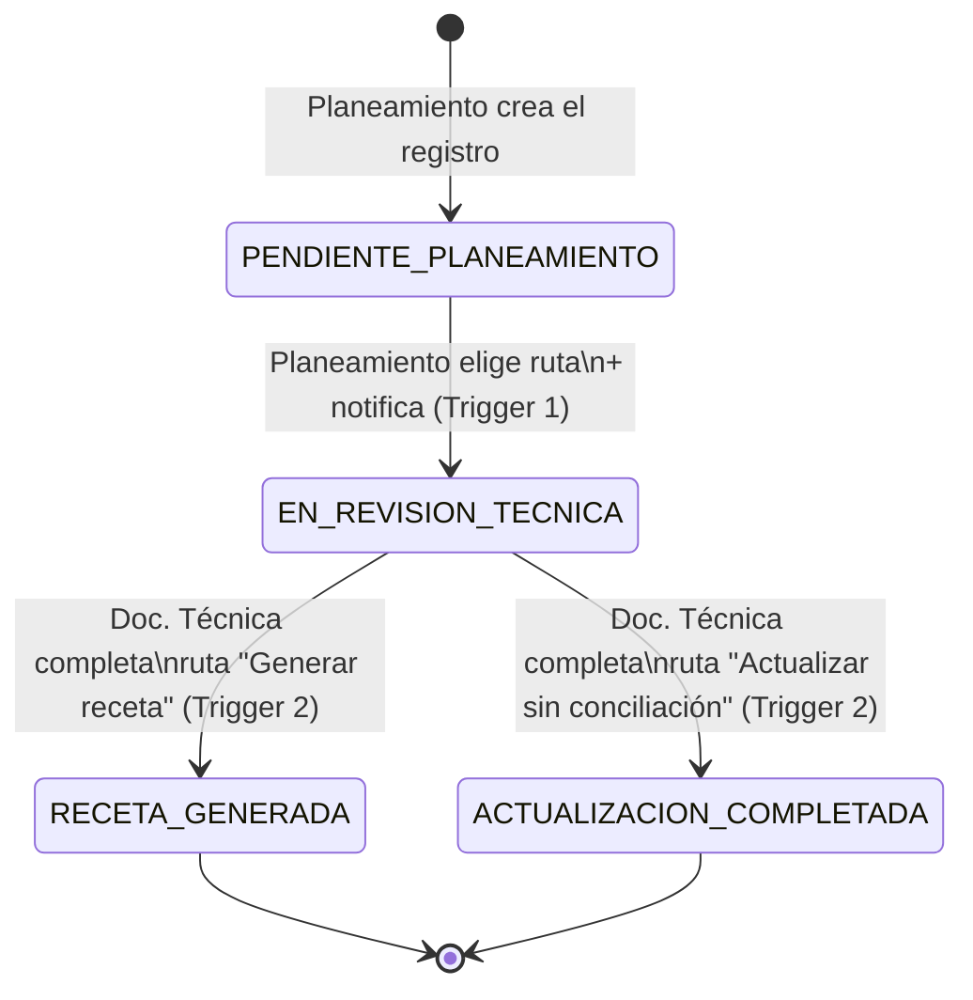

# Recetas de Conciliación — Diseño de Solución

Reemplazo del Excel "Cuadro de Conciliaciones" (histórico analizado: 1369 filas con
Cod. Pro., Producto, Planta, Fecha de Conciliación, Motivo de Conciliación y columnas
de respuesta libre por área — Almacén, Asuntos Regulatorios, Diseño/Logística,
Documentación Técnica — sin ningún control de estado real, solo una "X" al final).

Este documento cubre los 3 entregables solicitados:
1. Esquema de base de datos relacional.
2. Arquitectura del backend para el envío de correo asíncrono.
3. Controlador de API que procesa el cambio de estado y dispara el correo.

---

## 1. Esquema de base de datos relacional

Motor de desarrollo: **SQLite** (cero configuración). El `datasource` de Prisma se
cambia a `postgresql` con una línea para producción — el resto del código no cambia.

> SQLite no soporta `enum` nativo en Prisma, por eso los campos de tipo cerrado
> (`role`, `estado`, `tipoFlujo`, `trigger`, `estado` de correo) se modelan como
> `String` y se validan con Zod en el backend y con listas TypeScript compartidas en
> el frontend (`backend/src/types/enums.ts` y `frontend/src/types.ts` son la misma
> fuente de verdad). Al migrar a PostgreSQL pueden volver a ser `enum` nativos.


Definición completa en [`backend/prisma/schema.prisma`](../backend/prisma/schema.prisma).

### Por qué estas entidades

- **`ConciliationRecord`** es la fila del Excel, normalizada: `Cod. Pro.`, `Producto`,
  `Planta`, `Fecha de Conciliación`, `Motivo de Conciliación` se mapean 1 a 1. Se le
  agrega `tipoFlujo` (la decisión de ruta) y `estado` (el estado de cumplimiento).
- **`RecordLote`** normaliza los lotes/materiales que en el Excel viven como texto
  libre dentro de una sola celda — así se pueden listar, contar y (a futuro) filtrar.
- **`TechnicalResponse`** es 1 a 1 con el registro y contiene exactamente los campos
  que pidió el rol Documentación Técnica: Variantes, Ejecución, Observaciones.
- **`EmailRecipient`** guarda qué correos se ingresaron en el campo de etiquetas del
  frontend, por cada disparador — sirve de bitácora ("¿a quién se le avisó y cuándo?").
- **`EmailLog`** es el **outbox** de correo (ver sección 2): la fuente de verdad de
  qué se envió, con qué asunto/cuerpo, y si falló.
- **`StatusHistory`** es la auditoría de estados — reemplaza el control manual que el
  Excel no tenía; permite ver quién movió el registro y cuándo.
- **`User.role`** son exactamente los 3 roles pedidos: `PLANEAMIENTO`, `DOC_TECNICA`,
  `ADMIN` (este último para administración/soporte, no forma parte del flujo de negocio).

### Extensibilidad (no implementada en este MVP, pero prevista)

El Excel original también tenía columnas de **Almacén**, **Asuntos Regulatorios** y
**Diseño/Logística**. Este MVP implementa solo los 2 roles que pediste (Planeamiento y
Documentación Técnica), pero el modelo no cierra la puerta a agregarlos: bastaría con
sumar un campo `area` a `TechnicalResponse` (o una tabla `AreaResponse` genérica con
`area` + los mismos 3 campos) y un nuevo valor de `Role`, sin tocar el resto del
esquema ni el flujo de estados.

---

## 2. Arquitectura del backend para correo asíncrono

**Objetivo del requisito**: el usuario escribe un correo y presiona "Enviar/Guardar";
el backend hace todo lo demás, sin que dependa de tener Outlook abierto. La regla de
oro es que **la request HTTP que guarda datos nunca espera a que SMTP responda.**

### Patrón: Outbox + Worker

```
┌─────────────┐   1. POST /records/:id/decision        ┌──────────────┐
│  Frontend   │ ───────────────────────────────────────▶│  Controller  │
│ (React)     │   { tipoFlujo, destinatarios[] }         │  (Express)   │
└─────────────┘                                          └──────┬───────┘
                                                                 │ 2. transacción DB:
                                                                 │    - update estado
                                                                 │    - insert StatusHistory
                                                                 │    - insert EmailRecipient(s)
                                                                 │    - insert EmailLog (PENDIENTE)
                                                                 ▼
                                                          ┌──────────────┐
                                                    3.    │   EmailLog   │  ◀── outbox
                                              responde ───│   (SQLite)   │
                                              200 OK      └──────┬───────┘
                                                                 │ 4. poll cada N ms
                                                                 ▼
                                                          ┌──────────────┐
                                                          │ email.worker │
                                                          │ (background) │
                                                          └──────┬───────┘
                                                                 │ 5. nodemailer.sendMail()
                                                                 ▼
                                                          ┌──────────────┐
                                                          │ SMTP Office  │──▶ Bandeja Outlook
                                                          │ 365 / otro   │    del destinatario
                                                          └──────────────┘
```

1. El controlador valida los datos y, dentro de **una sola transacción de Prisma**,
   cambia el estado, guarda el historial y **encola** el correo (`EmailLog`,
   estado `PENDIENTE`) — no llama a SMTP directamente.
2. La API responde de inmediato (`200 OK`) con el registro actualizado. El usuario ve
   su cambio guardado al instante, sin esperar el envío.
3. Un **worker en proceso separado** (`src/services/email.worker.ts`), arrancado junto
   al servidor, revisa la tabla cada `EMAIL_WORKER_INTERVAL_MS` (5s por defecto) y
   despacha los correos `PENDIENTE`/`FALLIDO` con reintentos pendientes vía
   **Nodemailer** sobre SMTP.
4. Si el envío falla (SMTP caído, credenciales vencidas), se marca `FALLIDO` con el
   error y se reintenta en la siguiente pasada, hasta `MAX_INTENTOS` (5). Nada de esto
   bloquea al usuario ni requiere que reintente manualmente.

### Por qué este patrón y no una cola con Redis/BullMQ

Para el tamaño de este sistema (cientos/miles de correos, no millones), una tabla-outbox
en la misma base de datos da:
- **Cero infraestructura adicional** (no hay que operar Redis).
- **Atomicidad gratis**: el cambio de estado y el "voy a enviar este correo" quedan en
  la misma transacción — si la transacción falla, no queda un correo fantasma encolado.
- **Reintentos y auditoría** ya vienen incluidos (`intentos`, `ultimoError`, `estado`).

Si el volumen crece mucho, el mismo contrato (`encolarCorreo` → tabla → worker) se
puede mover a BullMQ/Redis o a una cola gestionada (SQS, Service Bus) cambiando solo
`email.service.ts` y `email.worker.ts`, sin tocar los controladores.

### Envío real: SMTP de Microsoft 365/Outlook

El correo final vive en Outlook de los destinatarios, pero el **envío lo hace el
backend por su cuenta**, vía SMTP AUTH:

```
SMTP_HOST=smtp.office365.com
SMTP_PORT=587
SMTP_USER=conciliaciones@tuempresa.com   (buzón de servicio, no el de una persona)
SMTP_PASSWORD=...                         (App Password o cuenta dedicada)
```

Con eso, `nodemailer` despacha el correo sin que nadie tenga Outlook abierto en su
máquina. Cambiar a SendGrid/Amazon SES es solo cambiar esas 4 variables de entorno
(`backend/.env`) — el código no depende del proveedor.

Plantillas HTML en `src/services/email.templates.ts` (una por trigger), con los datos
del registro inyectados automáticamente — el usuario nunca redacta el correo.

---

## 3. Controlador clave: cambio de estado + disparo de correo

Ver [`backend/src/controllers/records.controller.ts`](../backend/src/controllers/records.controller.ts).
Dos funciones implementan literalmente el requisito (arriba, "El backend captura
estos correos y envía automáticamente..."):

- **`decidirRuta`** — Trigger 1 (Planeamiento guarda datos + elige ruta):
  recibe `tipoFlujo` y `destinatarios[]` desde el campo de etiquetas del frontend,
  cambia `estado` a `EN_REVISION_TECNICA`, y llama a `encolarCorreo(...)`.
- **`completarTarea`** — Trigger 2 (Documentación Técnica termina):
  recibe los campos técnicos + `destinatarios[]`, cambia `estado` a `RECETA_GENERADA`
  o `ACTUALIZACION_COMPLETADA` (según la ruta elegida por Planeamiento), y también
  llama a `encolarCorreo(...)`.

Ambas comparten el mismo patrón, todo dentro de `prisma.$transaction`:

```ts
export async function decidirRuta(req: Request, res: Response) {
  const { id } = req.params;
  const { tipoFlujo, destinatarios } = decisionSchema.parse(req.body);
  // ... valida que el registro exista y esté en el estado correcto ...

  const emails = normalizarDestinatarios(destinatarios); // valida formato, dedup

  const record = await prisma.$transaction(async (tx) => {
    const actualizado = await tx.conciliationRecord.update({
      where: { id },
      data: { tipoFlujo, estado: "EN_REVISION_TECNICA" },
    });

    await tx.statusHistory.create({ data: { /* auditoría */ } });

    await encolarCorreo({
      record: actualizado,
      trigger: "NUEVO_REQUERIMIENTO",
      destinatarios: emails,
      tx, // misma transacción: si algo falla, no queda correo huérfano
    });

    return actualizado;
  });

  res.json(record); // responde de inmediato; el envío real lo hace el worker
}
```

`encolarCorreo` (en `email.service.ts`) arma el asunto/cuerpo con la plantilla
correspondiente y crea la fila en `EmailLog` — el envío real ocurre después, en
background, como se describe en la sección 2.

---

## Flujo de estados



## Roles y permisos (resumen)

| Acción                                   | Planeamiento | Doc. Técnica | Admin |
|-------------------------------------------|:---:|:---:|:---:|
| Crear registro / datos base              | ✅ | — | ✅ |
| Elegir ruta + notificar (Trigger 1)      | ✅ | — | ✅ |
| Editar Variantes/Ejecución/Observaciones | — | ✅ | ✅ |
| Completar tarea + notificar (Trigger 2)  | — | ✅ | ✅ |
| Ver tablero / detalle                    | ✅ | ✅ | ✅ |

Implementado con JWT + middleware `requireRole(...)` en `backend/src/middleware/auth.ts`.
